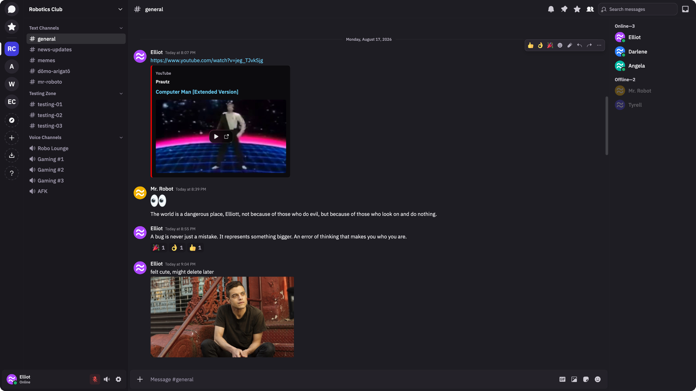

  <picture>
    <source media="(prefers-color-scheme: dark)" srcset="./fluxer_static/marketing/branding/logo-white.svg">
    
  </picture>

  
  
  

# Fluxer

Fluxer is a free and open source instant messaging and VoIP chat app built for friends, groups, and communities.

  

